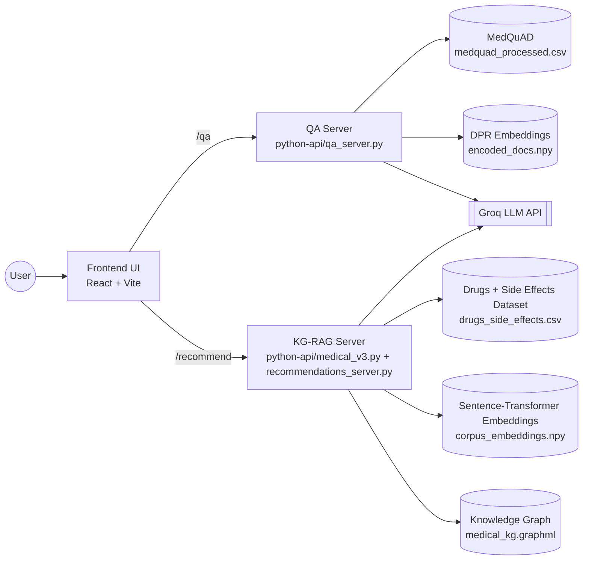
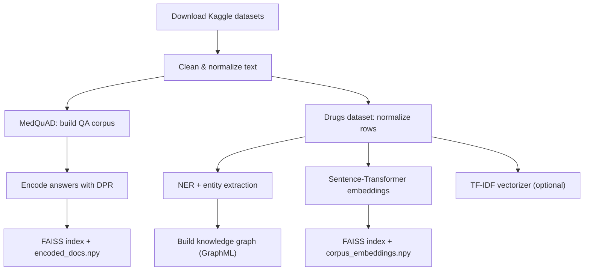
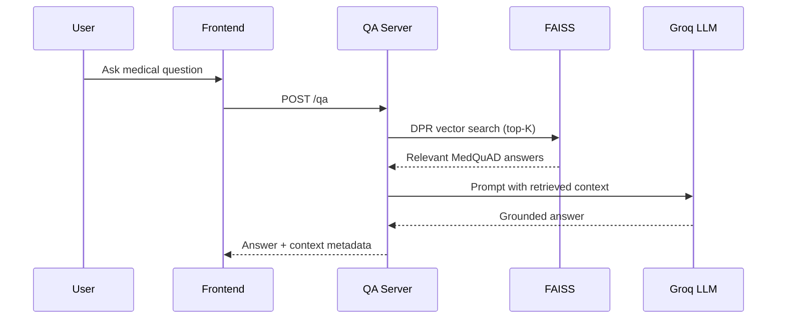
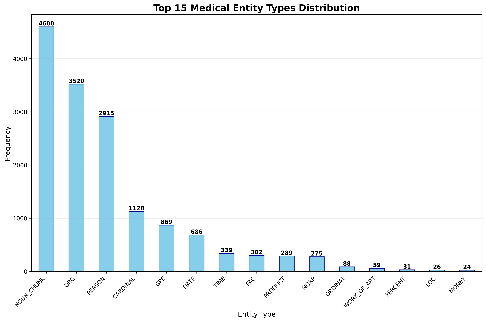
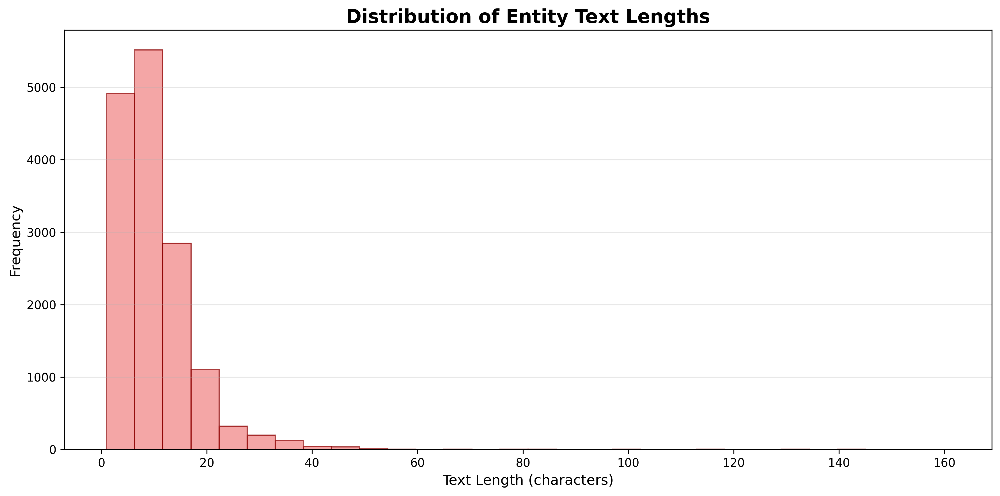

# MedAssistant - Your Doorstep Doctor

An end-to-end, Retrieval-Augmented Generation (RAG) medical assistant that combines a React frontend with **two dedicated Python servers**: one optimized for medical Q&A and another for knowledge-graph-driven medicine recommendations. The project uses two Kaggle datasets, NLP pipelines (NER, embeddings, TF-IDF), and knowledge graph expansion to deliver contextual answers and recommendations.

---

## Table of Contents
- [What was built](#what-was-built)
- [Datasets](#datasets)
- [System architecture](#system-architecture)
- [End-to-end workflow](#end-to-end-workflow)
- [Data preparation & artifacts](#data-preparation--artifacts)
- [Backend servers (2 Python services)](#backend-servers-2-python-services)
- [Runtime pipelines](#runtime-pipelines)
- [API endpoints](#api-endpoints)
- [Visualizations](#visualizations)
- [Project structure](#project-structure)
- [Setup & run locally](#setup--run-locally)
- [Tech stack](#tech-stack)
- [Disclaimer](#disclaimer)

---

## What was built
The goal of MedAssistant is to answer medical questions **and** suggest medicines with context. To do that, the system combines:

1. **Dense retrieval (DPR + FAISS)** for MedQuAD medical Q&A.
2. **Knowledge Graph RAG** for medicine recommendations.
3. **Named Entity Recognition (NER)** for extracting medical entities from user input.
4. **Semantic retrieval** using SentenceTransformer embeddings (plus TF-IDF artifacts for lexical fallback/experimentation).
5. **LLM generation** via Groq, grounded on retrieved context.

The core idea is: **retrieve first, then generate**. Each server handles a specific retrieval workflow and sends the resulting context to the LLM.

---

## Datasets
| Dataset | Purpose | Output files |
| --- | --- | --- |
| [MedQuAD](https://www.kaggle.com/datasets/pythonafroz/medquad-medical-question-answer-for-ai-research) | Medical Q&A corpus for DPR retrieval | `python-api/data/medquad_processed.csv`, `python-api/embeddings/encoded_docs.npy` |
| [Drugs, Side Effects, and Medical Conditions](https://www.kaggle.com/datasets/jithinanievarghese/drugs-side-effects-and-medical-condition) | Drug/condition knowledge base for KG-RAG | `python-api/drugs_side_effects.csv`, `python-api/kg_rag_artifacts/*` |

---

## System architecture



---

## End-to-end workflow
1. **Dataset collection** from Kaggle.
2. **Cleaning & normalization** (text cleaning, column normalization).
3. **Embedding generation**:
   - DPR embeddings for MedQuAD answers.
   - Sentence-Transformer embeddings for drug/side-effect rows.
4. **Indexing** with FAISS for fast top‑K retrieval.
5. **Knowledge graph construction** from drug/condition/side-effect entities.
6. **Serving** via two Python servers and the React frontend.

---

## Data preparation & artifacts
Artifacts are precomputed in notebooks and stored in `python-api/embeddings` and `python-api/kg_rag_artifacts` so the servers can respond quickly at runtime. These artifacts are included in the repository. To regenerate them, follow the data-prep notebooks in `notebooks/` (for example, `medquadqa.ipynb` and `medicinerecommendation.ipynb`) to rebuild the cleaned CSVs, embeddings, FAISS indices, and knowledge graph outputs.



### Artifact inventory (generated once, reused at runtime)
| Artifact | Location | Purpose |
| --- | --- | --- |
| `medquad_processed.csv` | `python-api/data/` | Cleaned QA corpus |
| `encoded_docs.npy` | `python-api/embeddings/` | DPR document vectors |
| `corpus_embeddings.npy` | `python-api/kg_rag_artifacts/` | Drug dataset embeddings |
| `faiss.index` | `python-api/kg_rag_artifacts/` | Dense search index |
| `medical_kg.graphml` | `python-api/kg_rag_artifacts/` | Knowledge graph structure |
| `ner_entities.csv` | `python-api/kg_rag_artifacts/` | Extracted NER entities |
| `tfidf_vectorizer.npz` | `python-api/kg_rag_artifacts/` | Optional lexical fallback/experiments |

---

## Backend servers (2 Python services)
The backend intentionally uses **two separate servers** for clarity and scalability.

| Server | Script | Port | Purpose |
| --- | --- | --- | --- |
| **QA Server** | `python-api/qa_server.py` | `5001` | DPR + FAISS + Groq RAG for medical Q&A |
| **Recommendation Server** | `python-api/recommendations_server.py` | `5002` | HTTP wrapper that imports the KG-RAG pipeline in `medical_v3.py` for medicine recommendations |

`recommendations_server.py` is a thin Flask wrapper that imports the KG-RAG pipeline logic from `medical_v3.py`.

> There is also a combined `python-api/app.py` server (default port `5000`) for quick demos or unified testing, but the **primary workflow uses the two servers above**.

---

## Runtime pipelines

### 1) Q&A server pipeline (MedQuAD + DPR)



**Key implementation facts (from `qa_server.py`):**
- Uses `facebook/dpr-question_encoder-single-nq-base` to encode questions.
- FAISS `IndexFlatIP` for inner‑product similarity search.
- Uses `llama-3.1-8b-instant` on Groq for response generation.

---

### 2) Knowledge Graph RAG pipeline (Drugs dataset)

```mermaid
flowchart TD
    A[Symptoms + Additional Info] --> B[NER + noun-chunk extraction]
    B --> C[Match tokens to KG nodes]
    C --> D[Expand subgraph (radius=2)]
    A --> E[Sentence-Transformer embedding]
    E --> F[Top‑K semantic rows via FAISS]
    D --> G[KG triples]
    F --> H[Dataset row context]
    G --> I[Compose final context]
    H --> I
    I --> J[Groq LLM answer]
```

**Key implementation facts (from `medical_v3.py`):**
- Uses **scispaCy** (fallback to spaCy) for biomedical NER.
- Uses `all-MiniLM-L6-v2` for semantic embeddings.
- Expands KG subgraph with a configurable radius.
- Composes context as **KG triples + top‑K dataset rows**.

---

## API endpoints

### QA Server (`http://localhost:5001`)
```http
POST /qa
Content-Type: application/json

{
  "question": "What are the side effects of aspirin?"
}
```

### Recommendation Server (`http://localhost:5002`)
```http
POST /recommend
Content-Type: application/json

{
  "symptoms": ["headache", "fever"],
  "additional_info": "Symptoms for 2 days, no known allergies."
}
```

---

## Visualizations
Artifacts from data exploration and NER processing are available and can be reused in reports or presentations:




---

## Project structure
```
MedAssistant---Your-Doorstep-Doctor-/
├── src/                         # Frontend React components
├── public/                      # Static assets + visualization images
├── python-api/
│   ├── qa_server.py             # DPR + FAISS + RAG Q&A server
│   ├── medical_v3.py            # KG‑RAG pipeline logic
│   ├── recommendations_server.py# HTTP server for recommendations
│   ├── app.py                   # Optional unified API server (port 5000)
│   ├── data/
│   │   └── medquad_processed.csv
│   ├── embeddings/
│   │   └── encoded_docs.npy
│   ├── kg_rag_artifacts/
│   │   ├── corpus_embeddings.npy
│   │   ├── faiss.index
│   │   ├── medical_kg.graphml
│   │   ├── ner_entities.csv
│   │   └── tfidf_vectorizer.npz
│   ├── drugs_side_effects.csv
│   └── requirements.txt
├── notebooks/                   # Data prep + experimentation notebooks
└── package.json                 # Frontend dependencies
```

---

## Setup & run locally

### 1) Frontend
```bash
npm install
npm run dev
```
Frontend runs at **http://localhost:5173**.

### 2) Backend setup
```bash
cd python-api
pip install -r requirements.txt
python -m spacy download en_core_web_sm
python -m spacy download en_core_sci_sm
```

### 3) Run the two Python servers
```bash
# Terminal 1: QA server
cd python-api
python qa_server.py

# Terminal 2: Recommendation server
cd python-api
python recommendations_server.py
```
### 4) Environment variable
Set your Groq key before running the servers:
```bash
export GROQ_API_KEY="your_key_here"
```

---

## Tech stack
- **Frontend**: React 18, Vite, TypeScript, Tailwind, shadcn/ui
- **Backend**: Flask, Groq SDK, PyTorch, Transformers, FAISS
- **NLP**: scispaCy/spaCy, SentenceTransformers, NetworkX, scikit-learn

---

## Disclaimer
This project is for **educational and research purposes only**. It does **not** provide medical advice and should not replace professional medical consultation. Always consult qualified healthcare professionals for medical guidance.
